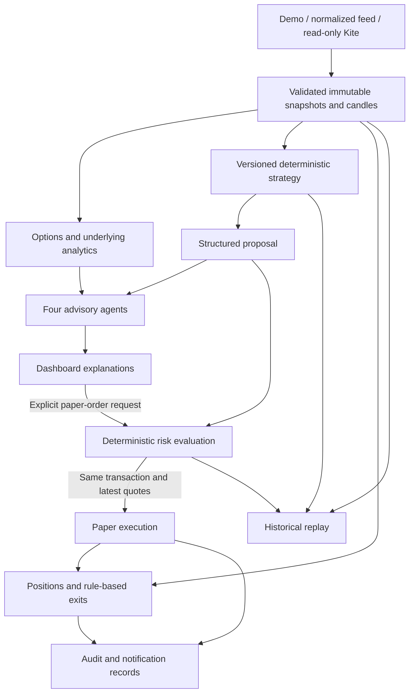
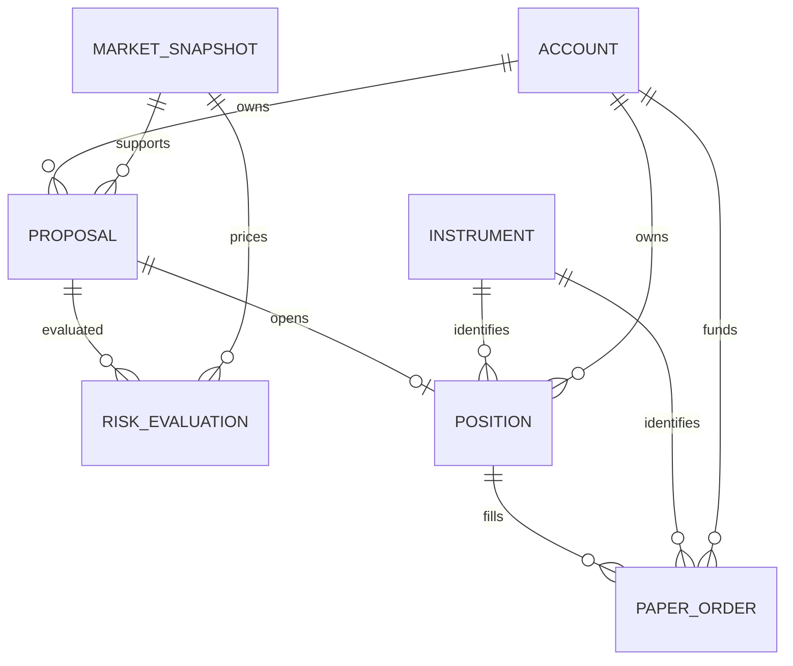

# Architecture and data model

## Decision: modular monolith first

Python/FastAPI owns the API and a small server-served dashboard. SQLAlchemy models and Alembic migrations run on SQLite for local development; PostgreSQL is the intended next deployment target. Business modules have explicit boundaries that can later become separate processes without making the first slice depend on a queue or a fleet of services.

There is no edge from model output to risk settings, execution commands, credentials, or order parameters. The agent module receives serialized context and returns an explanation. The first three roles explain market, chain, and deterministic proposal respectively; the fourth answers questions about the read-only state. They are not autonomous trading loops.

## Domain boundaries

| Module | Owns | Forbidden dependency |
| --- | --- | --- |
| `data` | Source validation, timestamps, metadata, ingestion | Advisory output as market truth |
| `analytics` | Pure numeric diagnostics | Broker state mutation |
| `strategies` | Signals and typed long-only trade intent | Broker credentials, language-model order decisions |
| `agents` | Four bounded explanations | Database sessions, risk mutations, broker/execution services |
| `risk` | Pure checks over current intent, quote, account state, clock, settings | LLM confidence or approval text |
| `execution` | Transaction coordination, funds, fills, positions, exits | Unchecked order parameters from a model |
| `brokers` | Paper fill model and provider translation | Implicit switch to live execution |
| `backtesting` | Chronological replay and reproducible report | Future observations when generating a signal |

## Persistence

| Table | Key and material fields | Purpose |
| --- | --- | --- |
| `accounts` | id, cash, starting_cash, kill_switch, data_source | Fixed `paper` account; serialized risk budget |
| `instruments` | exchange:symbol primary key; validated spec JSON | Underlying, strike, expiry, CE/PE, lot, tick, provider token |
| `market_snapshots` | id, source, underlying, timestamp index, payload | Immutable accepted snapshot with underlying and per-option timestamps |
| `historical_candles` | unique instrument + interval + UTC timestamp; OHLCV/OI payload | Idempotent history ingestion |
| `proposals` | id, account FK, snapshot FK, typed intent JSON, expiry, status | Versioned strategy output; never a broker order |
| `risk_evaluations` | proposal FK, snapshot FK, decision JSON, time | Every preview and execution-time decision |
| `paper_orders` | id, account FK, unique account/key, unique nullable proposal FK, position FK | One entry per proposal; separate exit order; fill price, quantity, fee, reason |
| `positions` | id, account/instrument/proposal FKs, entry, mark, timestamps, P&L, status | Single long option position |
| `agent_runs` | role, provider, context identifier, output, timestamp | Advisory provenance; no raw credentials |
| `audit_events` | monotonic id, event, entity, actor, payload, time | Ordered cursor-based operational trail |
| `notifications` | topic, message, delivery marker, timestamp | Persisted local inbox / future delivery outbox |
| `backtest_runs` | input dataset JSON, report JSON, timestamp | Reproducible snapshot replay |

JSON ingress uses strict Pydantic contracts; monetary inputs must be finite. Account/order/position money is `NUMERIC(20,4)` and Decimal in business logic. Greeks use floating-point mathematics. Store UTC, accept timezone-aware timestamps only, and interpret naive Kite timestamps as Asia/Kolkata. SQLite strips timezone metadata, so application reads explicitly restore UTC. SQLite numeric storage is suitable for this local simulation; validate PostgreSQL behavior before operational use.

Instrument metadata conflicts are rejected, not silently overwritten. Future master versioning should use effective dates and retain delisted contracts. Provider instrument tokens are attributes rather than durable identity because they can be reused after expiry. Historical corrections require a versioned dataset rather than silent candle replacement.

## Transaction and idempotency guarantees

All writes use `BEGIN IMMEDIATE` on SQLite or lock the single account row on PostgreSQL. Execution acquires this lock, checks an existing idempotency key, reads current quotes and account exposure, reevaluates risk, debits cash, creates the position and fill, changes proposal state, and appends audit/notification records before committing. No external network call occurs inside this transaction.

A retry with the same account/key returns the existing fill. Reusing the key for another proposal or operation returns a conflict. Another key cannot execute a filled proposal. Closing twice cannot create a second sell. Rejected risk checks persist even though no order is created. Failed transactions roll back all portfolio changes. SQLite contention tests exercise both identical and distinct concurrent keys.

This is a database-local paper guarantee. It does not imply exactly-once effects at a remote broker. A future live OMS needs submission intents, durable outbox, broker tags, uncertain-submission reconciliation, fill deduplication, partial-fill state, bounded retries, and explicit recovery. A successful Kite order submission returns an identifier, not proof of a fill; see [Kite order semantics](https://kite.trade/docs/connect/v3/orders/).

## Risk and exit semantics

Entry checks cover paper/source boundary, kill switch, proposal validity, snapshot and underlying freshness, open-position mark freshness, long-only intent, cash, per-trade and aggregate premium, loss guard, position count, duplicate contract, quote presence, instrument identity, option freshness, expiry cutoff, whole lots, tick alignment, spread, OI, depth, and price limit.

Maximum risk for the initial long-only strategy is premium paid plus illustrative entry fees. Aggregate risk conservatively sums open entry premiums, even when prices fall. The loss guard sums today's closed net P&L in IST and all open unrealized P&L including entry fees. It includes carryover unrealized losses and is not a full session-baselined drawdown calculation.

Paper entries fill all-or-none at ask + one tick, only within the stored limit and displayed ask size. Exits fill at bid − one tick, floored at one positive tick, with sufficient displayed bid size. Marks use bid. Fees default to ₹20 per order solely as a simulation assumption; they omit actual brokerage schedules, STT, GST, stamp duty, exchange and regulatory charges. Stops are triggers, not guaranteed execution prices.

Exit rules run on each ingestion and every five seconds in the API process: stop, target, expiry cutoff, then maximum holding time. The entry kill switch does not prevent exits and does not liquidate positions itself. Missing/stale quotes or expired contracts generate attention instead of invented fills. The process must stay running; the current monitor is not an independent always-on service.

## Replay semantics

Snapshots must be strictly ordered, have one source and underlying, and include real option quotes for real research. A signal from t can first fill at t+1; the original limit and TTL still apply. Backtesting shares the strategy, paper broker and entry risk evaluator. It currently holds one position, uses a cumulative loss guard across the replay, and closes at the final valid observation where possible. It omits execution queues, complete fees/taxes, assignment/settlement, session calendars and multi-leg effects. Input snapshots and report are saved for exact reruns.

## Expansion points

Add strategies through the typed registry; add advisory providers through the provider protocol; add feed sources through normalizers. Broker translation is distinct from submission. Multi-leg or short-option strategies require a new payoff/margin model, portfolio Greeks, hedge/legging failure policy and dedicated tests before expanding the accepted intent schema. Multi-account support requires scoped queries and one lock/risk budget per account; the current schema alone does not make the application multi-tenant.
